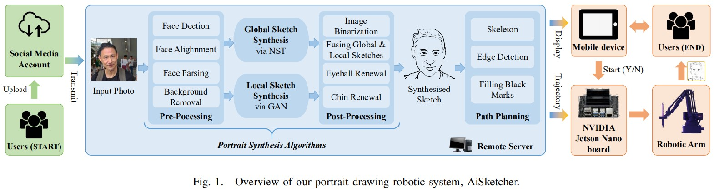
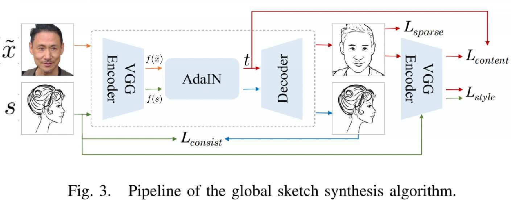
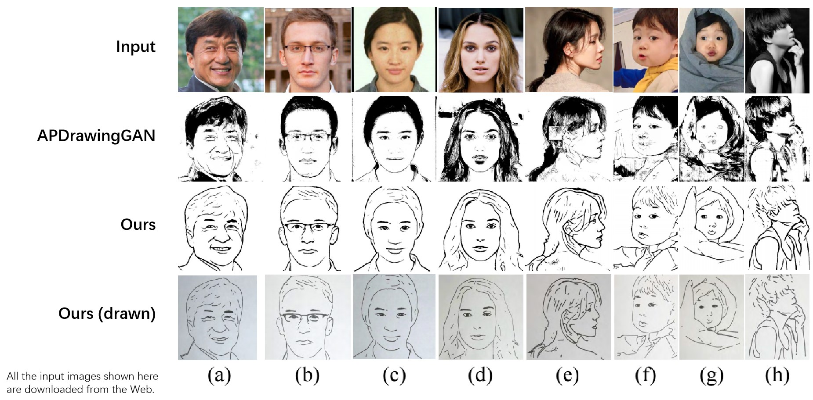
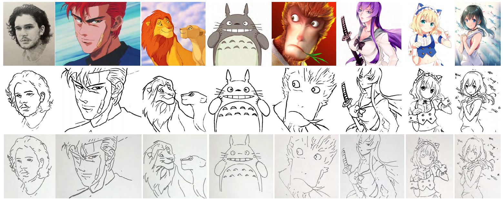
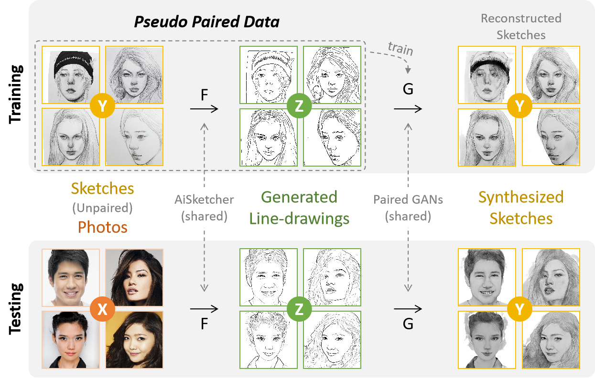

# AiSketcher
[**AiSketcher**](https://ricelll.github.io/AiSketcher/): **Portrait Drawing Robot**. 

> **Fei Gao**, Jingjie Zhu, Zeyuan Yu, Peng Li, Tao Wang, "**Making Robots Draw A Vivid Portrait In Two Minutes**," in *the Proceedings of the 2020 IEEE/RSJ International Conference on Intelligent Robots and Systems* (IROS 2020), pp. 9585-9591, Las Vegas, USA, 2020. 
>
> [[paper_iros]](https://ras.papercept.net/proceedings/IROS20/1854.pdf) ~ [[paper_arXiv]](https://arxiv.org/abs/2005.05526) ~ [[project]](https://ricelll.github.io/AiSketcher/)

### Pipeline

### Global sketch generator

### Results

more results are shown in our [project page](https://ricelll.github.io/AiSketcher/).

### Try it.

- You can try an update of this work in WeChat or Browser:

>  左侧为`妙绘艺术`微信小程序

<video width="480" height="270" controls>

<source src="AiSketcherRobot.mp4" type="video/mp4">

</video>

### Extensions

- Meimei Shang, Fei Gao *, Xiang Li, Jingjie Zhu, Lingna Dai. **Bridging Unpaired Facial Photos And Sketches By Line-drawings**. 2021 IEEE International Conference on Acoustics, Speech and Signal Processing (ICASSP), 6-11 June 2021, Toronto, Ontario, Canada. (Accepted) https://github.com/fei-hdu/sRender

### Acknowledgement

- Our work is inspired by the [AdaIN](https://github.com/xunhuang1995/AdaIN-style) repository.